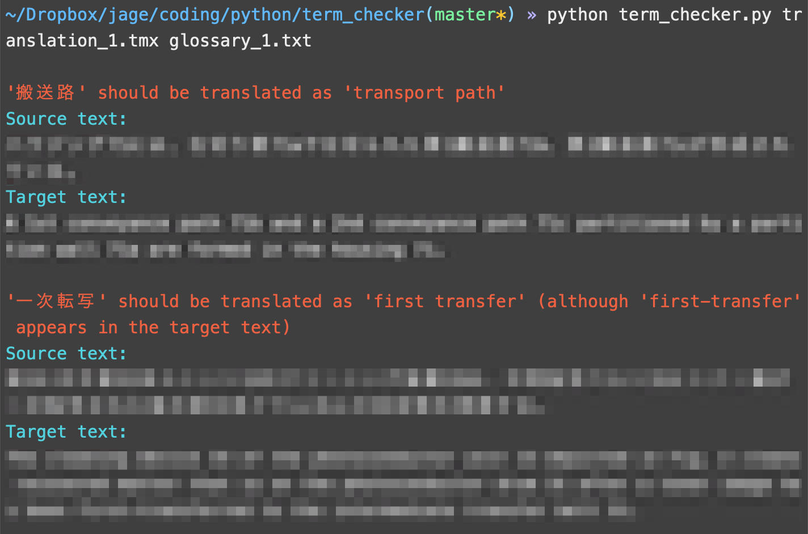

# Term Checker

A command line script to check whether correct terminology is being used in a translation regardless of the inflected form of the terminology, i.e. regardless of whether terminology appears in singular or plural form in the case of nouns or present or past tense and so forth in the case of verbs.

The translation is assumed to be a tmx file.

Terminology is assumed to be listed in a tab-delimited text file in the following format:
```
source_term<tab>target_term
```

If multiple target terms exist for a given source term, it is assumed that these are entered on separate lines rather than all on the same line, e.g.:
```
source_term<tab>target_term_1
source_term<tab>target_term_2
source_term<tab>target_term_3
```

### Running the script

From the directory containing this script, terminal:
```
python3 term_checker.py translation.tmx glossary.txt
```

### Prerequisites

* Python 3
* [Spacy](https://spacy.io/usage)
* [Spacy en_core_web_sm](https://spacy.io/models/en) (trained model for English)
* [colorama 0.4.3](https://pypi.org/project/colorama/) (to make output easier to read)
* [translate-toolkit 2.5.0](https://pypi.org/project/translate-toolkit/) (for handling tmx files)
* [pytest 5.4.1](https://docs.pytest.org/en/latest/getting-started.html) (for running the tests)

### Built using:

* Python 3.7.6
* Visual Studio Code 1.44.2
* macOS 10.14.6

### Example output:

(Please excuse the blurring but the translation text here is confidential.)

</br>

### License

Licensed under the MIT License.
